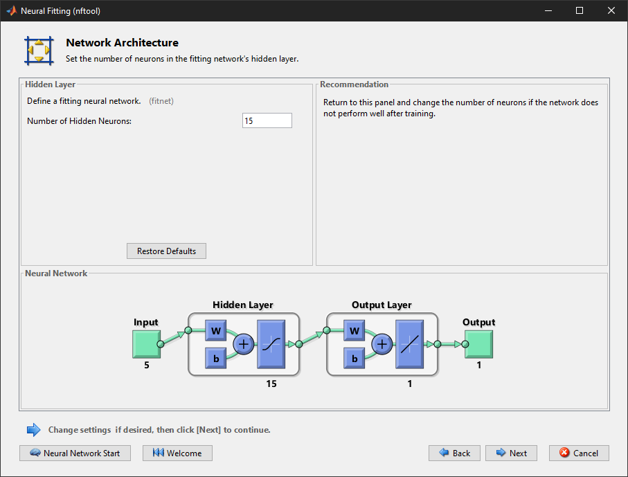
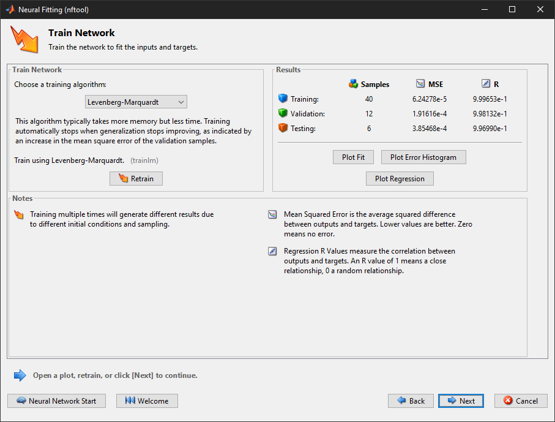

# MatLAB ile Öğrenme İşlemi


``` php
/* 
 * Oluşturduğumuz sicaklik.csv verisetini matlab'la 
 * aktarmak için kullanılan kodlar... */
dataset = csvread('sicaklik.csv',1,1,[1 1 58 7]);
```

``` php
/* 
 * oluşturduğumuz dataset değişkeninde yer alan
 * giriş değerlerimizi input değişkenine atdık... */
input = dataset(:,1:5);
```

``` php
/* 
 * tahminde bulunmasını istediğimiz değerli sicaklik_sabah,
 * ve sicaklik_aksam olarak iki farklı output değerine 
 * atadık... */
output_sicaklik_sabah = dataset(:, end-1);
output_sicaklik_aksam = dataset(:, end);
```

Veriler `input` ve `output` değişkenlerine aktarıldıktan sonra öğrenme işlemi gerçekleştirme için. `APPS -> Neural Net Fitting` ile öğrenme işlemi adımlarına geçildi. Öğrenme işlemi;

- Sıcaklık (sabah)
- Sıcaklık (akşam)

olarak iki farklı sonuca göre öğrenme işlemi yapıldı.

<br>

## AKŞAM SICAKLIĞI VERİSİ

### ÖĞRENME ADIMLARI


**ADIM 1 :** Elde edilen veriler `Neural Fitting (nftool)` aracı kullanılarak öğrenme işlemi başlatıldı.

<br>
 

**ADIM 2 :** Girdi değeri olarak başla oluşturduğumuz `input` değişkeni kullanıldı. Şuan öğrenme işlemi **sıcaklık akşam** verileri olduğu için çıktı değerleri olarak `output_sicaklik_aksam` değişkeni kullanıldı.

<br>


**ADIM 3 :** Öğrenme işlemi için `58` verilerin, **%70**'i Training (**eğitim**) `40 veri`, **%20**'si Validation (**doğrulama**) `12 veri`, **%10**'u Testing (**test**) `6 veri` için kullanıldı.

<br>


**ADIM 4 :** Öğrenme işlemi yapılırken kullanılacak nöron sayısı **15** olarak belirlendi.

<br>


**ADIM 5 :** Tüm veriler girildikten sonra Train (öğrenme) işlemi gerçekleştirildi.

<br>

### SONUÇLARIN YORUMLANMASI

**`Neural Fitting (nftool)` öğrenme işlemi için adımlar tamamladığında :**


Tüm veriler girildikten sonra Train (öğrenme) işlemi gerçekleştirildi.

- **MSE (Mean Squared Error - Ortalama Kare Hata) :** Basitçe, ortalama kare hata bir regresyon eğrisinin bir dizi noktaya ne kadar yakın olduğunu söyler. MSE, bir makine öğrenmesi modelinin, tahminleyicinin performansını ölçer, her zaman pozitif değerlidir ve MSE değeri sıfıra yakın olan tahminleyicilerin daha iyi bir performans gösterdiği söylenebilir. Aşağıdaki formül ile hesaplanabilir.

$$
MSE =
\frac{1}{n}
\sum_{t=1}^{n}
e_t^2
$$ 

- **R Değerleri:** Gerçek verileri ile tahmin edilen verilerin arasındaki ilişkisi tanımlar. Tahmin gücü $R^2$ olarak ifade edilmektedir. $R^2$ değeri, $-1$ ile $1$ arasında değişen değerler almaktadır. $R^2$ değeri $1$'e yaklaştıkça tahmin başarı oranı artmaktadır. $R^2=0$ ise tahmin edilen değerler ile verileri arasında hiç bir ilişkinin olmadığı anlamına gelir. $R^2$ değeri $-1$'e yaklaştıkça ise tahmin edilen verileri ile gerçek veriler arasında bir ters orandı olduğu anlamına gelmektedir. Bazı durumlarda **MAPE**'de kullanılabilir.
  
- **MAPE (Mean Absolute Percentage Error - Ortalama Mutlak Yüzde Hata) :** Regresyon ve zaman serileri modellerinde tahminlerin doğruluğunu ölçmek için ortalama mutlak yüzde hata sıkça kullanılmaktadır. MAPE için kullanılan formül aşağıdadır.

$$
MAPE =
\frac{100}{n}
\sum_{j}^{n} 
\frac{|e_j|}{|A_j|}
$$ 


<br>

### GRAFİKLER


- **Histogram Grafiğine** baktığımızda, $Error = Tragets - Outputs$ eşitliğini görmekteyiz. Buradaki $Targets$ ifadesi gerçek değerleri temsil etmektedir. $Outputs$ ise öğrenme sonucu oluşan değeri temsil etmektedir.

<br>


- Gerçek veriler $0,0$ noktasında $1,1$ noktasına çizilen doğru ile ifade edilmektedir. Dolayısıyla öğrenme işlemi sırasında yapılan tahminler bir doğru yakın olması yapılan öğrenme işlemin başarı olduğunu gösterir.


<br>


# BAŞARI ORANLARI

| # | $R$ değerleri (SS) | $R$ değerleri (AS) |
|:--:|:-:|:-:|
| **Training** | 0.94780 | 0.99965 |
| **Validation** | 0.89885 | 0.99813 |
| **Test** | 0.89449 | 0.99699 |
| **All** | 0.91398 | 0.99923 |

`AS: Akşam sıcaklığı` - `SS: Sabah sıcaklığı` 